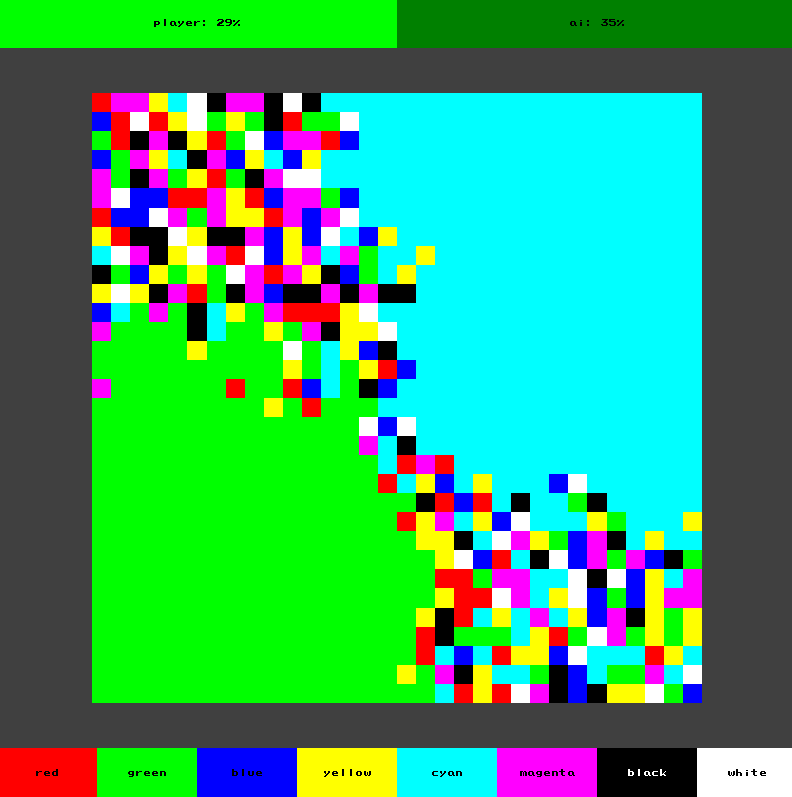

# square-color

`square-color` is a game where you should control more territory than your opponent when all the territory is occupied.

# Installation

## Prerequisite

This projects uses:

- [google test](https://github.com/google/googletest): installation instructions [here](https://www.eriksmistad.no/getting-started-with-google-test-on-ubuntu/), a simple `apt-get` should be enough.
- `cmake`: installation instructions [here](https://askubuntu.com/questions/355565/how-do-i-install-the-latest-version-of-cmake-from-the-command-line), a simple `apt-get` should also be enough.
- [eigen](https://eigen.tuxfamily.org/index.php?title=Main_Page): installation instructions [here](https://www.cyberithub.com/how-to-install-eigen3-on-ubuntu-20-04-lts-focal-fossa/) for Ubuntu 20.04, a simple `sudo apt install libeigen3-dev` should be enough.

## Instructions

- Clone the repo: `git clone git@github.com:Knoblauchpilze/pge-app.git`.
- Clone dependencies:
  - [core_utils](https://github.com/Knoblauchpilze/core_utils)
  - [maths_utils](https://github.com/Knoblauchpilze/maths_utils)
- Go to the project's directory `cd ~/path/to/the/repo`.
- Compile: `make run`.

Don't forget to add `/usr/local/lib` to your `LD_LIBRARY_PATH` to be able to load shared libraries at runtime. This is handled automatically when using the `make run` target (which internally uses the [run.sh](data/run.sh) script).

# The game

The game is built in a standard way: a selection screen allows to pick a new game or load an existing one, before entering the game view.

## Purpose

As mentioned in the introduction, the goal of the game is to control more territory than your opponent.

In order to do this, the player starts with controlling 4 squares of the same color in the bottom left corner of the screen. The opponent is an AI which occupies 4 squares of color on the top right part of the screen.

The game consists of turns, where the player and the AI choose alternatively a new color using the buttons at the bottom of the screen. When a color is picked, all the squares of this color which are in contact with the territory currently controlled by the player will be transferred under its control.

By carefully picking which color to pick, the player should try to outsmart the AI and control more territory once all squares have been claiment. When it's done, a final message will resume the game (win, draw or loss).

## Structure of the app

The application has a standard structure:

- a welcome screen allows the user to either jump straight into a new game or pick a previously saved one.
- the load game screen allows to pick a previously saved game.
- the main game view is where the player faces (and tries to defeat) the AI.
- a round-up screen after the game is finished to either start a new game or go back to the main screen.

## The game view

The game view is the main screen that the user will see. It looks like so:

In order to pick a different color, the user can click on one of the button in the bottom part of the screen. Some buttons will be disabled:

- the color currently picked by the player
- the color of the AI in case the two territories of the AI and the player are in contact.

The top view indicates what percentage of the total territory is controlled by the player and the AI. This allows the player to check how they are doing along the game.

Each opponent is displayed with their current color. The player is playing and immediately after that the AI is automatically playing as well.

## AI

The AI in the game is supposed to offer some form of competition for the player. Nothing super fancy though. Each turn, the AI computes how many squares of each color are at the border with the currently controlled territory. It then picks the color which will bring the maximum extent of territory. In case none of the color bring anything, the AI is just randomly picking a color.

The AI (just like the player) is not allowed to take it's own color twice and the color of the player in case the territory are contiguous.

## End game

The game ends when none of the cells are not controlled by either the player or the AI. When this happens, the game will compute how many squares are controlled by each player and display a message accordingly, from the perspective of the user.

Here's what happens in case the user loses:

